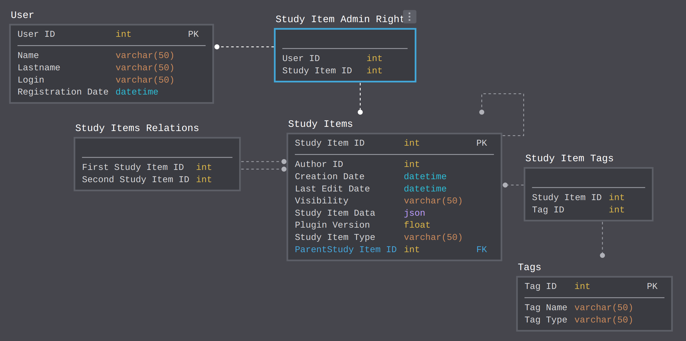

## EDU Server

Серевер для хранения материалов курсов для JetBrains EduTools Plugin .

### Текущая схема базы данных 

Сущности:
`User` и `Tag` --- пользователи и теги курсам. `Study Items`--- Все объекты, относящиеся к учебным материалам: Course, Course Version, Section, Lesson, Task.
Таблицы `Study Items` и `Study Items Relations` хранят структуру отношений в виде дерева, сохраняя предыдущие версии(ParentStudy Item ID указывает на него).

Изменение дерева.
Пусть задание было создано в версии n, тогда:
* Если изменение задания происходит в версии n, спускаемся вниз по дереву и заменяем текущую версию задания на новую, сохраняя ссылку на текущую.
* Если изменение задания происходит в версии n + 1,  то root'a Course создается еще один ребенок, отвечающий за текущую версию курса. Копируем весь путь от Course Version до листов, попутно сохраняя ссылки на неизмененные вершины и добавляя в таблицу `Study Items Relations` отношения для новых. 
