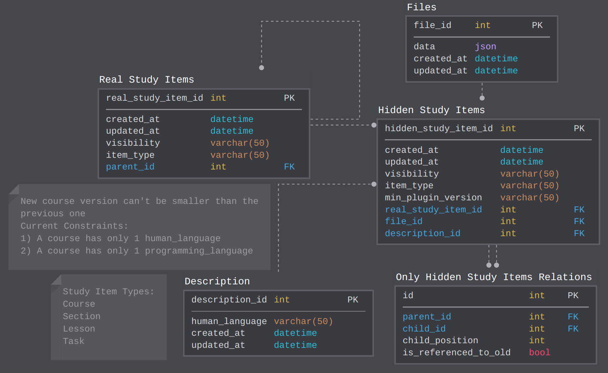

# EduServer Database

**Current database scheme:**

Entities:
`User` and `Tag` — users and course tags. `Study Items` — all objects related to educational materials: Course, Course Version, Section, Lesson, Task.

Table `Study Items Relations` stores all relations among `Study Items` and these relations look like tree below. Root is Course vertex. All subtree store course version for different plugin versions.

Tree update:
A Task was created in the plugin with version n, then:
* If an update was made in the plugin with version n + 1 and version of some `Study Item` is changed to new, then add new child to the root(vertex `Course`) and go down this subtree, saving references to unchanged `Tasks`, `Sections`, `Lessons` and creating new ones for the changed.
* If an update was made in the plugin with version n + 1 and version of some `Study Item` isn't changed to new, then go down the tree and change old versions of `Tasks`, `Sections` and `Lessons` by new ones, saving references to old in field `Parent Study Item ID`.
